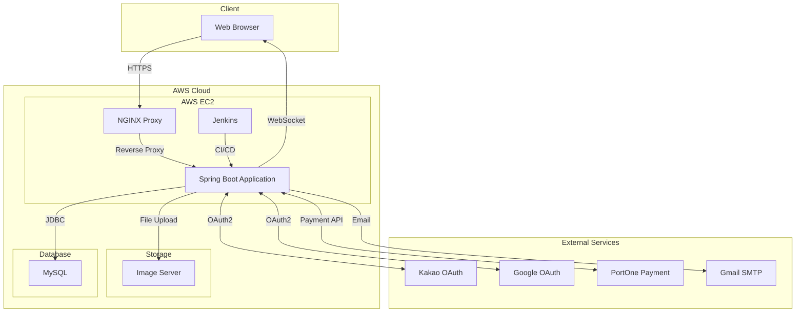

# 🛠 OneStack - IT 전문가 매칭 플랫폼

<p align="center">
  
</p>

## 📌 프로젝트 소개

OneStack은 IT 전문가와 의뢰인을 연결하는 매칭 플랫폼입니다. <br>
검증된 전문가 풀을 통해 신뢰성 있는 외주 서비스를 제공하며, 실시간 채팅과 프로젝트 관리 기능으로 효율적인 협업을 지원합니다.
- 개발 기간: 2024.01 ~ 2024.03 (3개월)
- 인원: 1명 (개인 프로젝트)
- 배포 URL: [ONE STACK](https://www.onestack.store)

### 🎯 핵심 가치
- **신뢰성**: 검증된 전문가 매칭 시스템
- **효율성**: 실시간 소통 및 프로젝트 관리
- **투명성**: 명확한 가격 정책과 리뷰 시스템

## 🛠 기술 스택

### Frontend


### Backend


### Database & Infrastructure


## 💡 주요 기능

### 1. 전문가 매칭 시스템
- 카테고리별 전문가 필터링: 기술 분야별 전문가 검색 및 필터링
- 무한 스크롤: 효율적인 전문가 리스트 로딩
- 전문가 프로필: 자세한 프로필 및 포트폴리오 관리
```java
@PostMapping("/proFilter")
public Map<String, Object> filterPros2(@RequestBody Map<String, Object> requestData) {
    List<String> appType = (List<String>) requestData.get("filters");
    String sort = (String) requestData.get("sort");
    int itemNo = (int) requestData.get("itemNo");
    int page = (int) requestData.get("page");
    int size = (int) requestData.get("size");

    // 필터 조건에 맞는 전문가 리스트 가져오기
    List<MemProAdInfoCate> pros = proService.getPaginatedFilteredAndSortedPros(
            appType, sort, itemNo, page, size);
    
    // 평균 가격 계산
    double overallAveragePrice = calculateAveragePrice(pros);
    
    // 응답 구성
    Map<String, Object> response = new HashMap<>();
    response.put("pros", pros);
    response.put("hasMore", pros.size() == size);
    response.put("overallAveragePrice", 
            String.format("%,d", (long) overallAveragePrice));
    
    return response;
}
```
### 2. 실시간 커뮤니케이션
- WebSocket 기반 실시간 통신: STOMP 프로토콜을 활용한 양방향 통신
- 채팅방 관리: 견적 별 채팅방 생성, 관리
- 메시지 저장: 모든 대화 내역 데이터베이스 저장
```java
@Configuration
@EnableWebSocketMessageBroker
public class WebSocketConfig implements WebSocketMessageBrokerConfigurer {

    @Override
    public void configureMessageBroker(MessageBrokerRegistry config) {
        // 메시지를 구독하는 prefix
        config.enableSimpleBroker("/topic", "/queue");
        // 메시지를 발행하는 prefix
        config.setApplicationDestinationPrefixes("/app");
    }

    @Override
    public void registerStompEndpoints(StompEndpointRegistry registry) {
        registry.addEndpoint("/ws-stomp")
                .setAllowedOriginPatterns("*")
                .withSockJS();
    }
}

@MessageMapping("/chat/message")
public void sendMessage(@Payload ChatMessage message) {
    // 메시지 저장
    message.setSentAt(LocalDateTime.now());
    chatService.saveMessage(message);
    
    // 특정 채팅방으로 메시지 전송
    messagingTemplate.convertAndSend(
            "/topic/chat/room/" + message.getRoomId(), message);
}
```
### 3. 채팅 협업 도구
- 게시판 기능: 채팅방 내 게시글 작성 및 관리
- 일정 관리: 프로젝트 일정 공유 및 관리 (FullCalendar api)
- 실시간 알림: 모든 액션에 대한 실시간 알림
```java
@PostMapping
public ResponseEntity<Map<String, Object>> createBoard(
        @RequestBody ChatBoardEvent board, HttpSession session) {
    Map<String, Object> response = new HashMap<>();
    
    chatBoardService.createBoard(board);
    
    Member member = (Member) session.getAttribute("member");
    
    // 시스템 메시지 생성
    ChatMessage systemMessage = new ChatMessage();
    systemMessage.setRoomId(board.getRoomId());
    systemMessage.setSender(member.getMemberId());
    systemMessage.setNickname(member.getNickname());
    systemMessage.setType("SYSTEM");
    systemMessage.setMessage(member.getNickname() + 
            "님이 게시글을 작성하였습니다.");
    systemMessage.setSentAt(LocalDateTime.now());
    
    // DB에 시스템 메시지 저장
    chatService.saveMessage(systemMessage);
    
    // 시스템 메시지를 웹소켓으로 전송
    messagingTemplate.convertAndSend(
            "/topic/chat/room/" + board.getRoomId(), systemMessage);
    
    return ResponseEntity.ok(response);
}
```
### 4. 카카오/구글 소셜 로그인
- OAuth2.0 인증: 카카오, 구글 소셜 로그인 지원
- 간편한 회원가입: 소셜 계정으로 간편 회원가입
- 보안 강화: 암호화된 계정 관리
```java
@GetMapping("/callback")
public String kakaoCallback(
    @RequestParam(name = "code", required = true) String code,
    HttpSession session,
    Model model) {
    
    try {
        // 1. 액세스 토큰 받기
        String accessToken = requestAccessToken(code);
        session.setAttribute("accessToken", accessToken);
        
        // 2. 사용자 정보 받기
        Map<String, Object> userData = requestUserInfo(accessToken);
        
        // 3. 카카오 ID 추출
        String kakaoId = userData.get("id").toString();
        Map<String, Object> properties = 
                (Map<String, Object>) userData.get("properties");
        String nickname = (String) properties.get("nickname");
        
        // 4. 기존 회원인지 확인
        Member existingMember = memberService.getMember(kakaoId);
        
        if (existingMember != null) {
            // 5a. 기존 회원이면 로그인 처리
            session.setAttribute("member", existingMember);
            session.setAttribute("isLogin", true);
            return "redirect:/mainPage";
        } else {
            // 5b. 신규 회원이면 추가 정보 입력 페이지로
            model.addAttribute("kakaoId", kakaoId);
            model.addAttribute("nickname", nickname);
            return "member/kakaoAddJoinForm";
        }
    } catch (Exception e) {
        return "redirect:/loginForm?error=kakao";
    }
}
```
### 5. 결제 시스템
- 포트원 결제 연동: 안전한 결제 프로세스
- 결제 검증: 서버 사이드 결제 검증
- 결제 내역 관리: 사용자별 결제 내역 관리
```java
public boolean verifyPayment(String impUid, int estimationNo, int paidAmount) 
        throws Exception {
    // 1. 액세스 토큰 발급
    String accessToken = getAccessToken();

    // 2. 결제 정보 조회 API 호출
    RestTemplate restTemplate = new RestTemplate();
    String url = "https://api.iamport.kr/payments/" + impUid;
    
    HttpHeaders headers = new HttpHeaders();
    headers.set("Authorization", accessToken);
    HttpEntity<Void> entity = new HttpEntity<>(headers);
    
    ResponseEntity<String> response = 
            restTemplate.exchange(url, HttpMethod.GET, entity, String.class);
    
    // 3. 결제 검증
    if (response.getStatusCode() == HttpStatus.OK) {
        JSONObject responseBody = new JSONObject(response.getBody());
        JSONObject paymentData = responseBody.getJSONObject("response");
        
        double amount = paymentData.getDouble("amount");
        String status = paymentData.getString("status");
        
        // 4. DB에서 주문 금액 조회
        double orderAmount = payMapper.getPrice(estimationNo);
        
        // 5. 결제 검증 로직
        if (amount == orderAmount && "paid".equals(status) && 
                paidAmount == amount) {
            return true;
        } else {
            throw new Exception("결제 검증 실패: 금액 또는 상태 불일치");
        }
    } else {
        throw new Exception("결제 정보 조회 실패");
    }
}
```

## 🏗 시스템 아키텍처



## 🚀 배포 환경

- **서버**: AWS EC2 (Ubuntu 20.04 LTS)
- **웹 서버**: NGINX 1.18
- **컨테이너화**: Docker & Docker Compose
- **CI/CD**: Jenkins Pipeline
- **데이터베이스**: MySQL 8.0
- **모니터링**: Spring Actuator


- 컨테이너화: Docker 및 Docker Compose를 활용한 애플리케이션 컨테이너화
```dockerfile
# Dockerfile
# 빌드 단계
FROM gradle:8.12-jdk17-alpine AS build

WORKDIR /app

# 의존성 먼저 복사 및 다운로드 (캐시 활용)
COPY build.gradle settings.gradle ./
RUN gradle dependencies --no-daemon

# 소스 복사 및 빌드
COPY src ./src
RUN gradle build --no-daemon -x test

# 실행 단계
FROM amazoncorretto:17-alpine

WORKDIR /app

# MySQL 설정 파일 생성
RUN mkdir -p /etc/mysql/conf.d
RUN echo "[mysqld]" > /etc/mysql/conf.d/my.cnf
RUN echo "bind-address = 0.0.0.0" >> /etc/mysql/conf.d/my.cnf
RUN echo "skip-name-resolve" >> /etc/mysql/conf.d/my.cnf

# 필요한 파일만 복사
COPY --from=build /app/build/libs/*.jar app.jar

ENV JAVA_OPTS="-Xms512m -Xmx512m"
ENV SERVER_PORT=8080

# MySQL 포트도 노출
EXPOSE 8080 3306

ENTRYPOINT ["sh", "-c", "java ${JAVA_OPTS} -jar app.jar"]
```

- CI/CD: Jenkins를 활용한 지속적 통합 및 배포
```yaml
 version: '3.8'

 services:
   db:
     image: mysql:8.0.41-bookworm
     container_name: myone
     ports:
       - "3306:3306"
     environment:
       MYSQL_ROOT_PASSWORD: Kyle9907!
       MYSQL_DATABASE: onestack
       MYSQL_USER: kyle
       MYSQL_PASSWORD: Kyle9907!
     networks:
       - onestack-network
     volumes:
       - mysql_data:/var/lib/mysql
       - ./src/main/resources/SQL:/docker-entrypoint-initdb.d
     command:
       - --character-set-server=utf8mb4
       - --collation-server=utf8mb4_unicode_ci
       - --default-authentication-plugin=mysql_native_password
     healthcheck:
       test: ["CMD", "mysqladmin", "ping", "-h", "localhost", "-u", "root", "-pKyle9907!"]
       interval: 30s
       timeout: 10s
       retries: 5
       start_period: 60s
     restart: always

   app:
     build:
       context: .
       dockerfile: Dockerfile
     container_name: onestack
     ports:
       - "1234:8080"
     depends_on:
       db:
         condition: service_healthy
     volumes:
       - /usr/share/nginx/html/images:/usr/share/nginx/html/images
     networks:
       - onestack-network
     environment:
       SPRING_DATASOURCE_URL: jdbc:mysql://db:3306/onestack?useSSL=false&allowPublicKeyRetrieval=true&characterEncoding=UTF-8
       SPRING_DATASOURCE_USERNAME: kyle
       SPRING_DATASOURCE_PASSWORD: Kyle9907!
       KAKAO_CLIENT_ID: ${KAKAO_CLIENT_ID}
       KAKAO_REDIRECT_URI: ${KAKAO_REDIRECT_URI}
       GOOGLE_CLIENT_ID: ${GOOGLE_CLIENT_ID}
       GOOGLE_CLIENT_SECRET: ${GOOGLE_CLIENT_SECRET}
       GOOGLE_REDIRECT_URI: ${GOOGLE_REDIRECT_URI}
       GMAIL_USERNAME: ${GMAIL_USERNAME}
       GMAIL_PASSWORD: ${GMAIL_PASSWORD}
       PORTONE_API_KEY: ${PORTONE_API_KEY}
       PORTONE_API_SECRET: ${PORTONE_API_SECRET}
     restart: always

 networks:
   onestack-network:
     driver: bridge

 volumes:
   mysql_data:
```

## 기술적 의사결정
### 1. WebSocket 기술 선택
- **결정** : Spring WebSocket + STOMP 프로토콜 채택
- **이유** :
  - 실시간 양방향 통신 지원
  - STOMP를 통한 메시지 라우팅 단순화
  - 확장성 및 성능 최적화
### 2. MyBatis ORM 채택
- **결정** : JPA 대신 MyBatis 사용
- **이유** :
    - 복잡한 SQL 쿼리 직접 작성 가능
    - 높은 성능 및 최적화 용이
    - 조인 쿼리 처리 효율적
### 3. Docker 컨테이너화
- **결정** : Docker와 Docker Compose 활용
- **이유** :
    - 개발/운영 환경 일관성 확보
    - 배포 자동화 용이
    - 서비스 독립성 및 확장성

## 👥 프로젝트 기여도

### **Team Leader**
- 백엔드 개발 **(기여도 80%)**
- 프론트엔드 개발 (기여도 50%)
- 서비스 기획 (기여도 85%)
- 인프라 구축 및 배포 **(기여도 100%)**

## 📝 라이센스

이 프로젝트는 MIT 라이센스를 따릅니다. 자세한 내용은 [LICENSE](LICENSE) 파일을 참조하세요.
